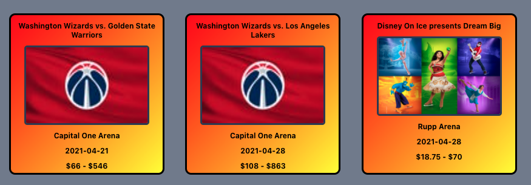

#Project litnight

litnight is a website that showcases upcoming events based off the ticketmaster api. 

##Idea vs Execution
Our Wireframe

Our Website

##As a user I can:
- See a page populated with upcoming events.

- Sort these events through options such as by date, highest price, and lowest price.
    * select form
    
    
        * date
        
        * highest price
        
        * lowest price
        
- Flip over the presented event cards to find more info about the event.

- Filter to find the most and least popular attraction.
    * most popular
    
    * least popular
    